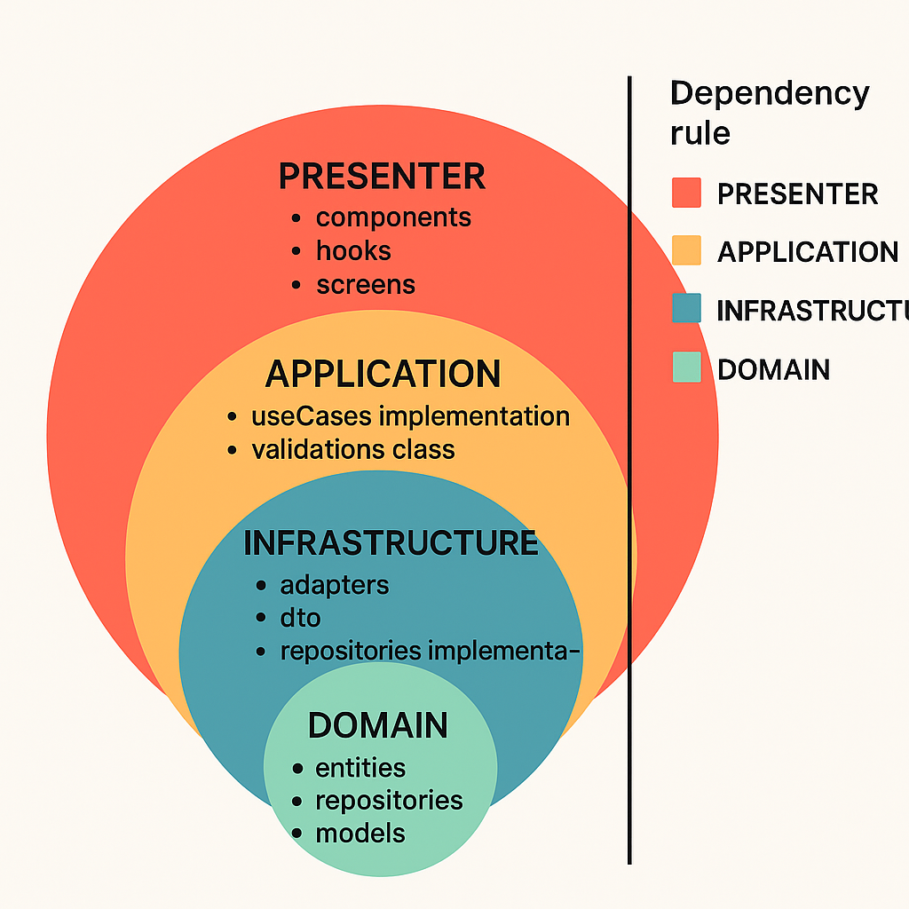
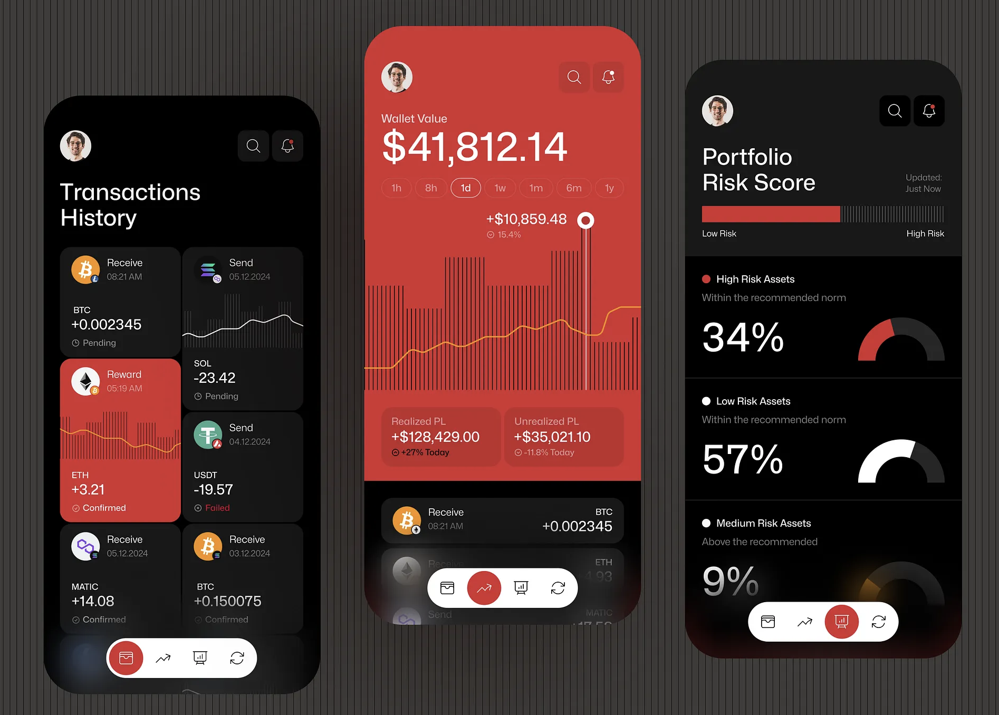
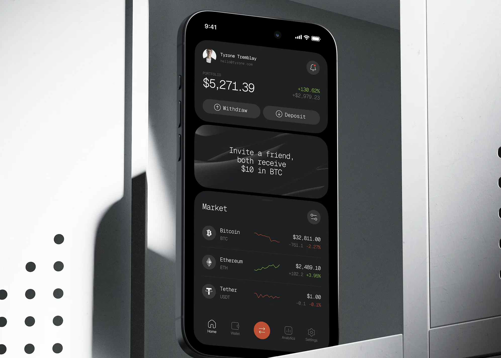
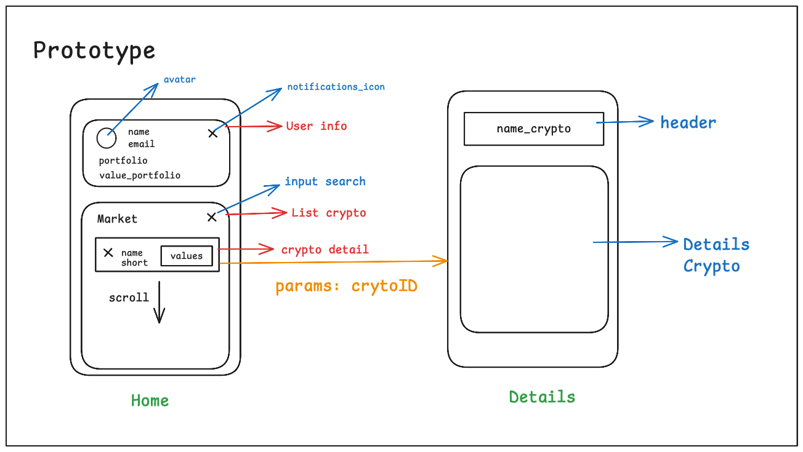

# 🚀 Million Technical Test

A Big Real Estate company requires creating mobile application by obtain information about crypto currency in USD, because governance decided used by currency default to EEUU. this one need create a list crypto currency, show exchange to USD, filter list and show detail.

https://www.coinlore.com/cryptocurrency-data-api

---

## 📑 Table of Contents

- [Introduction](#introduction)
- [Installation](#installation)
- [Usage](#usage)
  - [For development env in android](#for-development-env-in-android)
  - [For production env in android](#for-production-env-in-android)
  - [For development env in IOS](#for-development-env-in-ios)
  - [For production env in IOS](#for-production-env-in-ios)
- [Architecture](#architecture)
  - [Layers](#layers)
  - [Special Directories](#special-directories)
- [Prototyping](#prototyping)
  - [Final Sketch](#final-sketch)
- [Key Highlights](#keyhighlights)
- [Areas for Improvement](#areasforimprovement)
- [Developer Contact](#-developer-contact)

---

### Introduction

For more details, check out the [Usage](#usage) section.
Welcome to **Million Technical Test**. This project is presented as a solution to the technical test for the Senior React Native developer position at the company **Million**. Below is a detailed explanation of how to set up and run the project, as well as the creation process that was followed from the prototype to the final product.

---

### Installation

To run the project, please follow the guidelines provided in the official [**React Native**](https://reactnative.dev) documentation for version [**0.79.0**](https://reactnative.dev/docs/environment-setup) It will be assumed that you have already completed this setup and verified that it works correctly.

The project has two development environments: **production** and **development**, each with its corresponding environment variables file. For the project to work properly, you must create two .env files in the root directory, as described below:

.env.development for the development environment with the following content:

```
ENVIRONMENT=development
API_URL=https://api.coinlore.net/api/
```

.env.production for the production environment with the following content:

```
ENVIRONMENT=production
API_URL=https://api.coinlore.net/api/
```

Next, you will need to install the project dependencies. The following versions of package managers and tools were used in this project:

- yarn: 1.22.19
- node: 20.18.2
- cocoapods or pod: 1.16.2
- ruby: ruby 2.7.6p219 [arm64-darwin22]

For convenience, it is recommended to use nvm for managing Node.js versions and rbenv for managing Ruby versions.

For convenience, a script is also included to install all the dependencies, including the project's CocoaPods. To run it, execute the following command in your terminal:

```bash
yarn install-proyect
```

---

### Usage

As mentioned earlier, this project includes two development environments: production and development. The separation of these environments was implemented using application variants for Android and schemes for iOS. You can find more information about this type of setup in the official documentation for Android and iOS, respectively.

To run any development environment, open a terminal and execute the following command:

```bash
yarn start
```

Next, in a separate terminal, you must run the command corresponding to the environment you want to compile. For example:

#### For `development` env in `android`

```bash
yarn android:development
```

#### For `production` env in `android`

```bash
yarn android:production
```

#### For `development` env in `ios`

```bash
yarn ios:development
```

#### For `production` env in `ios`

```bash
yarn ios:production
```

---

### Architecture

For this project, a **layered architecture** was used, based on **Clean Architecture** principles and **Domain-Driven Design (DDD)**. The structure consists of the following layers:

#### Layers

- **`domain`**
  This is the most important layer, containing the core business logic, as well as contracts for use cases and repositories for each module.

- **`application`**
  This layer holds the implementation of use cases for each module.

- **`infrastructure`**
  This layer contains the implementation of repositories, DTOs, and adapters.

- **`presenter`**
  This layer handles all UI-related concerns of the module. It includes framework-specific implementations such as:

  - Hooks
  - Components
  - Utilities
  - Screens



#### Special Directories

- **`core`**
  Contains configuration logic for libraries and application-wide handlers.

- **`shared`**
  Holds common UI-related elements such as:

  - Reusable components
  - Utilities
  - Custom hooks
  - Navigation logic
  - Theming system

---

### Prototyping

For the prototyping of the application, the context of the information related to cryptocurrencies was taken into account. A search was conducted for app models related to this context, and the following designs available on Dribbble were used as references.

- [Prototype 1](https://dribbble.com/shots/25559085-Crypto-Trading-Mobile-App)



- [Prototype 2](https://dribbble.com/shots/24285689-Crypto-App-Design-Concept)



#### Final Sketch

As a final sketch based on the previous prototypes, the following diagram was created using Excalidraw and was used as the foundation for the UI development.



---

### Key Highlights

The following points stand out in the implementation of the project:

- **Implementation of application variants based on the development environment**, allowing customized handling of each environment, including specific configurations.
- **Implementation of Git flow** using `commitlint` for semantic commit verification, Git hooks with `husky` for executing scripts that check branch naming conventions and run tests on pre-push actions, and a script for the automatic generation of the pull request template.
- **Separation of project structure into layers** based on the principles of Domain-Driven Design (DDD) and Clean Architecture.
- **Implementation of the Presenter pattern** to separate business logic from UI representation.
- **Configuration of Jest** for running tests.
- **Implementation of the Repository pattern** for handling network requests.
- **Implementation of the Facade pattern** to abstract Axios and provide custom control over request execution.
- **Implementation of namespaces** for managing models.

---

### Areas for Improvement

The following aspects can be considered as points for improvement in the project implementation:

- Implementation of a test suite using **`react-native-testing-library`**, which is currently the recommended testing library according to the official documentation. An 80% code coverage can be considered acceptable, with a focus on testing business logic (use cases and infrastructure).
- Improvement of API requests using **`react-query`**, which provides an abstraction layer for request generation and enables caching of data.
- Implementation of an **`authentication flow`**.
- Implementation of functionality for users to select their preferred cryptocurrencies.
- Implementation ci/cd flow with **`fastlane`** and github actions.

### 👤 Developer Contact

<table>
  <tr>
    <td style="vertical-align: middle; text-align: center;">
      
    </td>
    <td style="vertical-align: middle; padding-left: 20px;">
      <p>Nicolas Niño</p>
      <p>📧 <strong>Email:</strong> <a href="mailto:nicolasemilionino@hotmail.com">nicolasemilionino@hotmail.com</a></p>
      <p>🐱 <strong>GitHub:</strong> <a href="https://github.com/NicolasNinoViancha" target="_blank">nicolasNinoViancha</a></p>
      <p>💼 <strong>LinkedIn:</strong> <a href="www.linkedin.com/in/nicolas-emilio-nino-viancha-3169a61b0" target="_blank">nicolasNinoViancha</a></p>
    </td>
  </tr>
</table>
